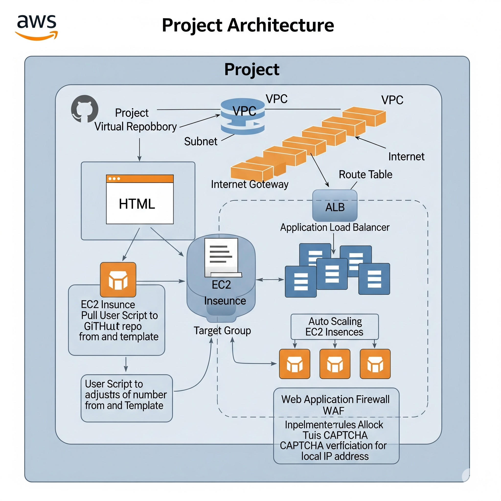

# 🚀 Secure Scalable Web App Deployment on AWS

This project demonstrates the deployment of a secure and scalable HTML-based web application using core AWS services. It includes version control with GitHub, auto-scaling EC2 instances, WAF protection, and a load-balanced architecture.

## 🔧 Technologies Used

- Amazon EC2 (User Data, Launch Template)
- VPC (Subnets, Route Tables, IGW)
- ALB (Application Load Balancer)
- Auto Scaling Group
- AWS WAF (Web Application Firewall)
- GitHub (for HTML source)
- Amazon Linux 2

---

## 📸 Project Architecture

----

## 🏗️ Architecture Overview

- Created a **VPC** with Public Subnet and attached **Internet Gateway**
- Setup **Route Table** to enable internet access
- Launched an **EC2 instance** using a **User Data** script to:
  - Install Apache
  - Pull HTML page from [GitHub](https://github.com/yourusername/yourrepo)
- Created a **Launch Template** from this EC2 instance
- Created an **Auto Scaling Group** attached to:
  - **Application Load Balancer (ALB)**
  - **Target Group** with EC2s
- Configured **AWS WAF** and attached it to ALB with rules:
  - ✅ Allow traffic from my IP
  - ❌ Block traffic from my IP (for test)
  - 🔐 CAPTCHA challenge for my IP

---

## 📸 Screenshots

> Located in the `Screenshorts` folder.Screenshorts
> 

- 📌 404 Forbiden
- 📌 Asg
- 📌 AWS Waf
- 📌 Load balancer
- 📌 capta rule
---

## 🌐 Access

Once deployed, the application is available via the **ALB DNS name**:

---

## 💡 Features

- ✅ Auto-scalable & fault-tolerant setup
- ✅ WAF-enabled security rules (Allow, Block, CAPTCHA)
- ✅ HTML code versioned on GitHub
- ✅ Public access controlled by security group + WAF

---

## 📌 To-Do (Optional Enhancements)

- Add HTTPS using ACM & Listener rules
- Add logging with CloudWatch
- Use SSM Parameter Store for secure configs

---

## 👨‍💻 Author

**Omkar Rawool**  
Aspiring AWS Cloud Engineer | [LinkedIn](https://www.linkedin.com/in/yourprofile)
